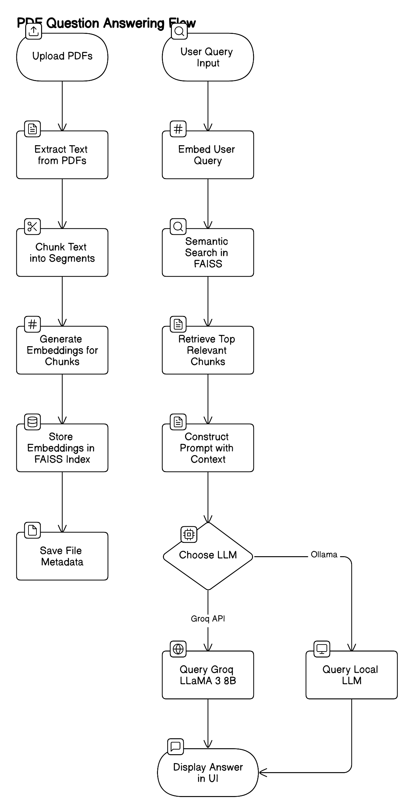
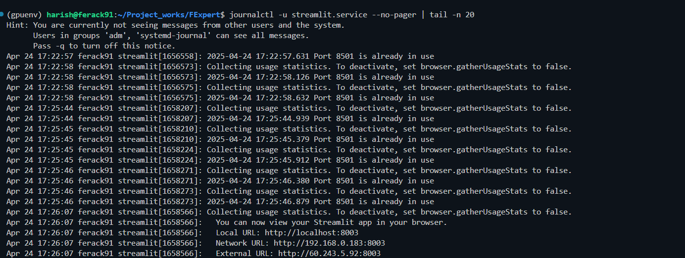
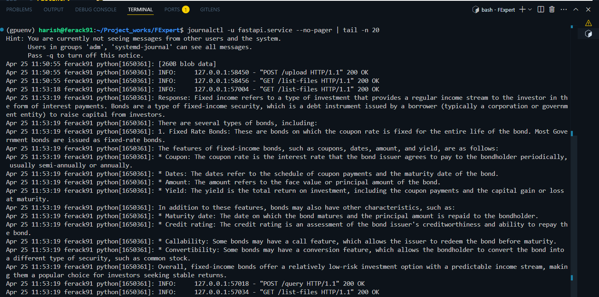
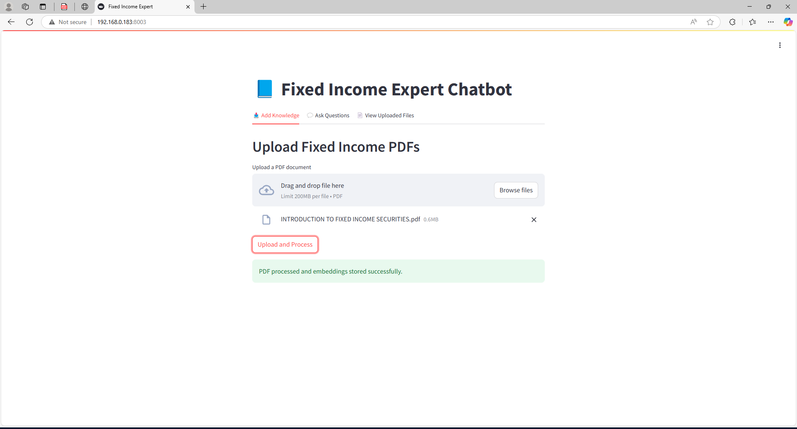

# 📘 Fixed Income Expert System

The **Fixed Income Expert** is an AI-powered system designed to help users learn, explore, and query company-specific financial knowledge, particularly related to fixed income bonds. It provides a chatbot interface where users can upload PDFs, ask natural language questions, and get contextual answers using LLMs and semantic search.

---

## 🚀 Features

- 🧑‍🧠 **Knowledge Ingestion**: Upload internal PDF documents and extract structured, chunked content using heading-based and recursive splitting strategies.
- 🔍 **Semantic Search with FAISS**: Find top relevant chunks using vector similarity with `SentenceTransformer` embeddings.
- 🤖 **LLM Answering**: Use `LLaMA3-8B` via [Groq API](https://groq.com/) to answer questions based on context.
- 📟 **File Metadata Management**: View all uploaded files with chunk statistics and upload timestamps.
- 🧼 **Clean Prompt Engineering**: Optimized system prompts for precise, context-only responses.
- 🧠 **Fully Modular Architecture**: Clean separation of backend (FastAPI) and frontend (Streamlit) with REST integration.

---

## 🏗️ Architecture Overview



---

## 🗂️ Project Structure

```
fixed-income-expert/
│
├── backend.py              # FastAPI backend logic
├── frontend.py             # Streamlit frontend interface
├── .env                    # Environment file for Groq API key
├── embeddings/             # Saved embedding .npy files
├── text_chunks/            # Pickled text chunks per document
├── metadata/               # JSON metadata for each uploaded PDF
├── requirements.txt        # Dependencies
└── README.md               # You are here
```

---

## 🧪 Tech Stack

- **Frontend**: Streamlit
- **Backend**: FastAPI
- **Embedding Model**: `sentence-transformers/all-MiniLM-L6-v2`
- **Vector Search**: FAISS
- **LLM Provider**: [Groq](https://groq.com/) (LLaMA 3 8B)
- **PDF Parsing**: PyMuPDF (`fitz`)
- **Text Splitting**: LangChain `RecursiveCharacterTextSplitter`

---

## ⚙️ Installation

1. **Clone the repo**

```bash
git clone https://github.com/your-username/fixed-income-expert.git
cd fixed-income-expert
```

2. **Create a virtual environment and install dependencies**

```bash
python -m venv venv
source venv/bin/activate  # or .\venv\Scripts\activate on Windows
pip install -r requirements.txt
```

3. **Add your Groq API Key**

Create a `.env` file:

```
GROQ_API_KEY=your_groq_api_key_here
```

4. **Run Backend**

```bash
uvicorn backend:app --host 0.0.0.0 --port 8002 --reload
```

5. **Run Frontend**

```bash
streamlit run frontend.py
```

---

## 🧠 How It Works

### 1. Upload PDF
- Text is extracted from the uploaded PDF.
- Split into logical chunks based on headings and subchunks via `RecursiveCharacterTextSplitter`.
- Each chunk is embedded using SBERT (`MiniLM`).
- Embeddings are stored in `.npy` files, and corresponding chunks are pickled.
- Metadata is stored as JSON.

### 2. Ask a Question
- The query is embedded and searched in the FAISS index.
- Top K relevant chunks are retrieved.
- Prompt is dynamically created with those chunks as context.
- Sent to the Groq-hosted LLaMA model for answering.

### 3. View Uploaded Files
- Shows all PDFs uploaded so far with metadata like number of chunks and upload time.

---

## 📌 API Endpoints

| Method | Endpoint       | Description                      |
|--------|----------------|----------------------------------|
| POST   | `/upload`      | Upload and process a PDF file    |
| POST   | `/query`       | Ask a question to the chatbot    |
| GET    | `/list-files`  | Get metadata of uploaded PDFs    |

---

## 🔐 Environment Variables

| Variable       | Description               |
|----------------|---------------------------|
| `GROQ_API_KEY` | Your Groq LLM API key     |

---

## 📼 Prompt Template

```text
You are a Financial Expert Bot. Your task is to provide accurate and concise answers
to the user's questions based on the provided context.

Instructions:
- No disclaimers or unnecessary information.
- No "I don't know" or "I'm an AI" type responses.
- If the answer is not in context, say: "The answer is not in the context."
```

---

## 📚 Example Use Case

- Upload internal bond documentation, deal sheets, or policy docs.
- Ask:  
  - “What is the maturity date for bond XYZ?”  
  - “Who is the issuer of the 2023 floating bond?”  
  - “List all callable bonds issued after 2020.”

---

## 🛠️ Requirements

Install them with:

```bash
pip install -r requirements.txt
```

Contents of `requirements.txt`:
```text
fastapi
uvicorn
streamlit
requests
python-dotenv
faiss-cpu
sentence-transformers
PyMuPDF
langchain
langchain-groq
```

---

## 📌 To Do / Ideas

- [ ] Add login authentication
- [ ] Allow multiple file selection and deletion
- [ ] Add PDF preview in frontend
- [ ] Enable offline LLM option (Ollama or LM Studio)
- [ ] Show sources used in the answer

---
##Hosted as Service and Interface View
# FactEntry FEexpert - Hosting Guide with FastAPI & Streamlit Services

This guide explains how the **FactEntry FEexpert** system (consisting of a FastAPI backend and Streamlit frontend) was set up and hosted as systemd services on a Linux server for internal organizational use.


## 🛠️ Step-by-Step Setup

### 1. 🔧 Create a Virtual Environment
```bash
python3 -m venv FExpENV
source FExpENV/bin/activate
```

### 2. 📦 Install Dependencies
```bash
pip install fastapi uvicorn streamlit
```

---

## 🧠 Hosting FastAPI as a Systemd Service

### 1. ✅ Find the full path of Python inside the venv
```bash
which python
# e.g., /home/harish/Project_works/FactEntry_FEexpert/FExpENV/bin/python
```

### 2. ✍️ Create FastAPI Service File
```bash
sudo nano /etc/systemd/system/fastapi.service
```

#### Paste the following:
```ini
[Unit]
Description=FastAPI backend for FactEntry FEexpert
After=network.target

[Service]
User=harish
WorkingDirectory=/home/harish/Project_works/FactEntry_FEexpert/backend
ExecStart=/home/harish/Project_works/FactEntry_FEexpert/FExpENV/bin/python /home/harish/Project_works/FactEntry_FEexpert/backend/backend.py
Restart=always

[Install]
WantedBy=multi-user.target
```

### 3. 🔄 Reload & Start FastAPI Service
```bash
sudo systemctl daemon-reload
sudo systemctl enable fastapi.service
sudo systemctl start fastapi.service
sudo systemctl status fastapi.service
```

---

## 🌐 Hosting Streamlit as a Systemd Service

### 1. ✅ Find the full path to Streamlit binary in venv
```bash
which streamlit
# e.g., /home/harish/Project_works/FactEntry_FEexpert/FExpENV/bin/streamlit
```

### 2. ✍️ Create Streamlit Service File
```bash
sudo nano /etc/systemd/system/streamlit.service
```

#### Paste the following:
```ini
[Unit]
Description=Streamlit frontend for FactEntry FEexpert
After=network.target

[Service]
User=harish
WorkingDirectory=/home/harish/Project_works/FactEntry_FEexpert/frontend
ExecStart=/home/harish/Project_works/FactEntry_FEexpert/FExpENV/bin/streamlit run /home/harish/Project_works/FactEntry_FEexpert/frontend/frontend.py --server.port 8501
Restart=always
Environment="PATH=/home/harish/Project_works/FactEntry_FEexpert/FExpENV/bin"

[Install]
WantedBy=multi-user.target
```

### 3. 🔄 Reload & Start Streamlit Service
```bash
sudo systemctl daemon-reload
sudo systemctl enable streamlit.service
sudo systemctl start streamlit.service
sudo systemctl status streamlit.service
```

---

## 🧪 Verify Deployment

- FastAPI should now be accessible on its configured port (default: 8000 if using uvicorn).
- Streamlit will be live at: `http://<your-server-ip>:8501`

---

## 🔄 Managing Services

```bash
sudo systemctl restart fastapi.service
sudo systemctl restart streamlit.service

sudo systemctl status fastapi.service
sudo systemctl status streamlit.service
```

---

---
## logs checking of service
```bash
journalctl -u streamlit.service --no-pager | tail -n 20
journalctl -u fastapi.service --no-pager | tail -n 20
```
---
## ✅ Notes
- Make sure your backend and frontend paths match your actual directory structure.
- Adjust the `--server.port` and host settings if needed.
- Ensure the server firewall allows the used ports (8501, etc.).

---

> This setup enables persistent deployment of the **FactEntry FExpert** system as services that start automatically on boot, providing a reliable and seamless experience for internal users.

---
## Service log
frontend service running on server

backend service running on server

## UI

 


---

---

## 🤝 Acknowledgments

- [Groq](https://groq.com/) – Ultra-fast LLM inference
- [HuggingFace](https://huggingface.co/) – SBERT embeddings
- [LangChain](https://www.langchain.com/) – Prompt templating and tools

---

## 📜 License

This project is licensed under the MIT License.

---

## 👨‍💼 Author

**Harish Kumar**  
- GitHub: [Harish-nika](https://github.com/Harish-nika)
- Email: [harishkumar56278@gmail.com](mailto\:harishkumar56278@gmail.com)
- portfolio: [Harish Kumar S - AI ML Engineer](https://harish-nika.github.io/)

Feel free to contribute and improve the project!
Built for internal use and educational purposes on financial knowledge management.

